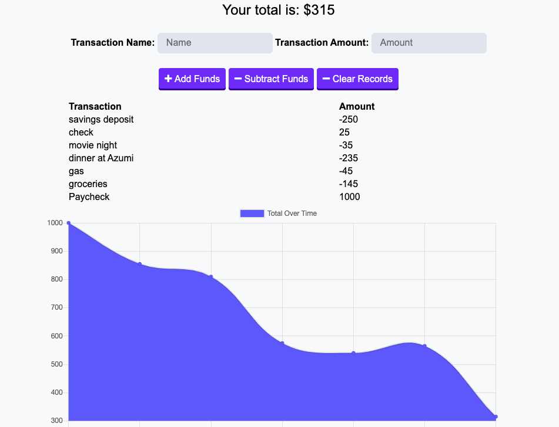

<!-- //////////////////////////// -->
# Online-Offline-Budget-Trackers
### A PWA that allows budget tracking on the go

This practice application allows a user add expenses and deposits to their budget with or without a connection. The basic functionality was provided, and the assignment was to convert it to a progressive web app.

## Viewing and using the website
<!-- Follow the link to the deployed application above, or  -->

- Clone and Download the repo
- Install the node dependencies:
`npm instal`
* express (routing)
* mongoose/mongodb (databse interface)
* morgan (reporting)
* lite-server
* mongojs
- Initialize the mongodb database (seed optional):
- Initalize the server
`npm start`

Offline Functionality:

  * Enter deposits offline

  * Enter expenses offline

When brought back online:

  * Offline entries should be added to tracker.

Here is an example of the front end application:

( Dates will also show, however for demonstration this was a busy day... )

All website assets are contained within the repo (https://github.com/anzook/Online-Offline-Budget-Trackers

## Acknowledgements and Credits

Website created as an assignment for the Johns Hopkins full-stack web development bootcamp (in partnership with Trilogy Education Services).
Guidance and assistance provided by:
* Stetson Lewis (Instructor)
* Donald Hesler (TA)
* Dan Thareja (Inspiration)